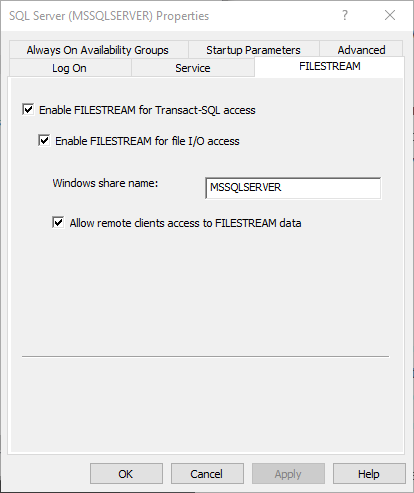

# FileStream Samples

Sample code for FILESTREAM in SQL Server

## Enable FILESTREAM

Task List

- Enabling the FILESTREAM feature for a given SQL Server instance
- Setting the access level for the FILESTREAM data
- Adding FILESTREAM storage to an existing database
- Adding a FILESTREAM column to an existing table
- Inserting BLOB data into the FILESTREAM column.

FILESTREAM 

- Support become available with SQL Server 2008 with FileTable available in SQL Server 2012
- Support is disabled by default and can be enabled for T-SQL or T-SQL + Streaming API access.
- Must be enabled twice:
  - First by the Windows Administrator
    - By installing a file system filter driver
  - And by the SQL Server Administrator
    - For each instance of the SQL Server 
    - And for each database within an enabled instance
- Set the same access level each time
  - Windows and SQL Server admins must agree

FILESTREAM Access Levels

- Disabled
  - FILESTREAM is not enabled
- T-SQL Access
  - FILESTREAM is enabled for T-SQL access
  - Memory consumption increases when accessing large BLOBs
- T-SQL + file system I/O (local)
  - FILESTREAM is enabled for T-SQL access and streamed file system access
  - Streaming API access available only to client applications running on the local server
- T-SQL + file system I/O (remote)
  - Streaming API access available to any remote client applications

Streaming api access can be enabled for local and/or remote access.
Does not burdern SQL Server with regard file streaming.

FILESTREAM can be enabled during setup or using SQL Server Configuration Manager.

To enable the FILESTREAM feature at the instance level run SQL Server Configuration Manager, then select SQL Server Services. Right-click on the appropriate instance, select Properties then move to the FILESTREAM tab. In here, you can enable the instance for T-SQL and file I/O streaming access.

Note that, to access FILESTREAM data through the streaming API, you must connect to SQL Server using Integrated Security (Windows authentication). If you connect to SQL Server using SQL Server authentication, you will get an "Access Denied" error when you try to open the FILESTREAM data file.

[Remote Blob Store (RBS) (SQL Server)](https://docs.microsoft.com/en-us/sql/relational-databases/blob/remote-blob-store-rbs-sql-server?view=sql-server-ver15)

SQL Server Remote BLOB Store (RBS) is an optional add-on component that lets database administrators store binary large objects in commodity storage solutions instead of directly on the main database server.

Enable FILESTREAM at the SQL Server Level

## PhotoLibraryDb

When creating PostDeployment scripts ensure the scripts are IDEMPOTENT when re-run and for various target databases.

## References

- [Binary Large Object (Blob) Data (SQL Server)](https://docs.microsoft.com/en-us/sql/relational-databases/blob/binary-large-object-blob-data-sql-server?view=sql-server-ver15) 
- [FILESTREAM (SQL Server)](https://docs.microsoft.com/en-us/sql/relational-databases/blob/filestream-sql-server?view=sql-server-ver15)
- [FILESTREAM in SQL Server - SQLShack](https://www.sqlshack.com/filestream-in-sql-server/)
- [SQL Server 2012-2014 Native File Streaming - Pluralsight](https://www.pluralsight.com/courses/sql-server-2012-2014-native-file-streaming)
- [The Art of SQL Server FILESTREAM](http://assets.red-gate.com/community/books/art-of-ss-filestream.pdf)
